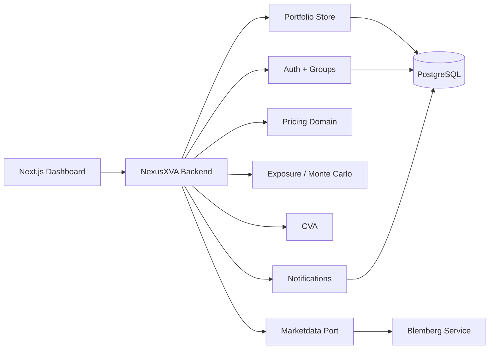
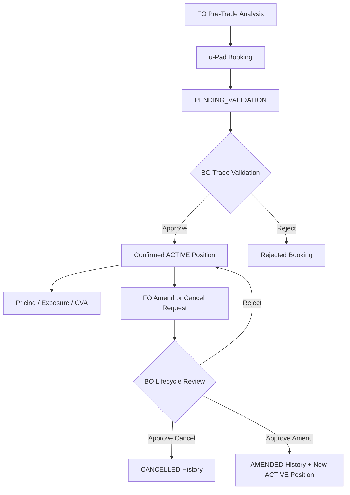

<p align="center">
  
</p>

# NexusXVA

NexusXVA es una workstation de riesgo para aprender y construir flujos tipo Front Office, Back Office y XVA sobre portfolios de opciones europeas.

El proyecto no intenta ser Murex ni Bloomberg. La idea es construir, paso a paso, una plataforma clara donde se vea el ciclo completo:

```text
FO analiza y bookea
  -> BO valida
  -> portfolio confirmado
  -> pricing
  -> exposure
  -> CVA
  -> dashboard operativo
```

## Estado Actual

- Backend Java Spring Boot con PostgreSQL, Flyway, JPA y Testcontainers.
- Frontend Next.js con pantallas por grupo activo.
- Auth con usuarios multi-grupo: `FO`, `BO`, `ADMIN`.
- Portfolio management persistido.
- u-Pad para enviar bookings a BO.
- Amendments y cancellations con maker-checker.
- Notificaciones persistidas por usuario.
- Trade economics V1 con premium de ejecucion y unrealized P&L.
- Snapshots EOD inmutables y Daily P&L contra el cierre anterior.
- Black-Scholes pricing individual y portfolio-level.
- Monte Carlo Exposure V1.
- CVA V1.1 con modo flat y curvas simples.
- Integracion market data via frontera `marketdata`, con Blemberg o provider local.

## Arquitectura



## Workflow Operativo



## Grupos

- **FO**: FO Desk, Pre-Trade Analysis, Stress Testing, u-Pad, Portfolios, Pricing, Exposure y CVA.
- **BO**: Trade Validation, Lifecycle Validation, Trading Limits y EOD Control.
- **ADMIN**: usuarios, grupos, permisos FO, visibilidad de portfolios y workflow map.

Un usuario puede tener varios grupos. Al hacer login elige el grupo activo de la sesion.

## Posiciones Y Lifecycle

Las posiciones confirmadas tienen `lifecycleStatus`:

- `ACTIVE`: entra en pricing, exposure, stress y CVA.
- `CANCELLED`: historica, no entra en analytics.
- `AMENDED`: historica, no entra en analytics.

Cuando BO aprueba un amendment, la posicion original queda `AMENDED` y se crea una nueva posicion `ACTIVE`. Por eso no se vuelve a modificar la posicion `AMENDED`; el siguiente cambio debe hacerse sobre la nueva posicion activa.

## Notificaciones

NexusXVA guarda notificaciones persistidas por usuario:

- BO recibe aviso cuando FO envia un booking, amendment o cancellation.
- FO recibe aviso cuando BO aprueba o rechaza sus solicitudes.
- La campana del header muestra unread count y permite marcar notificaciones como leidas.

## Trade Economics Y P&L

Los bookings de opciones pueden guardar un `executionPrice` opcional: el premium negociado por unidad. No debe confundirse con el strike ni con el spot.

```text
tradeValue = executionPrice * quantity
marketValue = theoreticalUnitPrice * quantity
unrealizedPnl = marketValue - tradeValue
```

Las posiciones historicas sin premium siguen siendo validas, pero muestran P&L como no disponible en vez de asumir un costo cero.

## EOD Y Daily P&L

EOD no modifica el premium original ni las posiciones. Guarda una fotografia inmutable del cierre:

```text
Durante el dia:
  unrealized P&L = market value actual - trade value original

Al cierre:
  guardar snapshot EOD por portfolio y posicion

Dia siguiente:
  daily P&L = market value actual - market value del EOD anterior
```

Una posicion creada despues del cierre usa su execution premium como referencia diaria. Si no existe EOD ni execution premium, Daily P&L queda no disponible.

Desde `EOD Control`, BO ejecuta un cierre global para todos los portfolios. Cada portfolio se procesa de forma independiente y el batch informa `CAPTURED`, `SKIPPED` o `FAILED`, de modo que un libro con problemas no oculta el resultado de los demas. El selector de portfolio se usa despues para inspeccionar su historial.

El scheduler esta apagado por defecto. Se puede habilitar con:

```bash
NEXUSXVA_EOD_ENABLED=true docker compose up --build
```

El default corre a las `17:15` de lunes a viernes en `America/New_York`. EOD rechaza market data stale y portfolios con posiciones activas no valorables.

## Usuarios Y Portfolios P&L Demo

Flyway crea tres usuarios adicionales:

| Usuario | Password | Grupo | Portfolios |
|---|---|---|---|
| `fo.tech` | `fo12345` | FO | Tech Options, US Banks |
| `fo.macro` | `fo12345` | FO | US Banks, Macro Hedges |
| `bo.pnl` | `bo12345` | BO | Validacion y control |

Portfolios creados:

- `P&L Demo - Tech Options`
- `P&L Demo - US Banks`
- `P&L Demo - Macro Hedges`

Cada libro incluye execution premiums y un EOD anterior de prueba.

## Correr Todo

```bash
docker compose up --build
```

URLs habituales:

- Frontend: `http://localhost:3000`
- Backend: `http://localhost:8080`
- Blemberg externo, si esta levantado: `http://localhost:8081`

## Documentacion

- Backend: [backend/README.md](backend/README.md)
- Logica del sistema EN: [docs/docs-EN/SystemLogic.md](docs/docs-EN/SystemLogic.md)
- Logica del sistema ES: [docs/docs-ES/LogicaDelSistema.md](docs/docs-ES/LogicaDelSistema.md)
- Conceptos financieros EN: [docs/docs-EN/FinancialConcepts.md](docs/docs-EN/FinancialConcepts.md)
- Conceptos financieros ES: [docs/docs-ES/ConceptosFinancieros.md](docs/docs-ES/ConceptosFinancieros.md)
- Proceso EOD ES: [docs/docs-ES/ProcesoEOD.md](docs/docs-ES/ProcesoEOD.md)
- EOD process EN: [docs/docs-EN/EodProcess.md](docs/docs-EN/EodProcess.md)

## Siguiente Camino

Los siguientes candidatos naturales son:

- Multi-leg option strategies.
- Cash equities y delta hedging.
- Persisted valuation run history.
- Mejor reporting FO/BO sobre lifecycle.
- UI para CVA curve mode.
- Counterparties, netting y collateral.
- FX y multi-currency.
