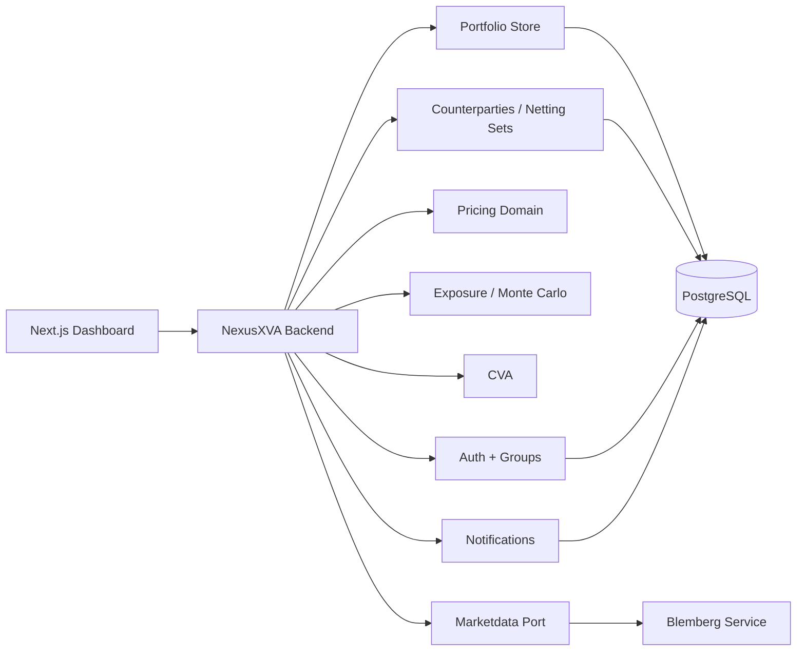
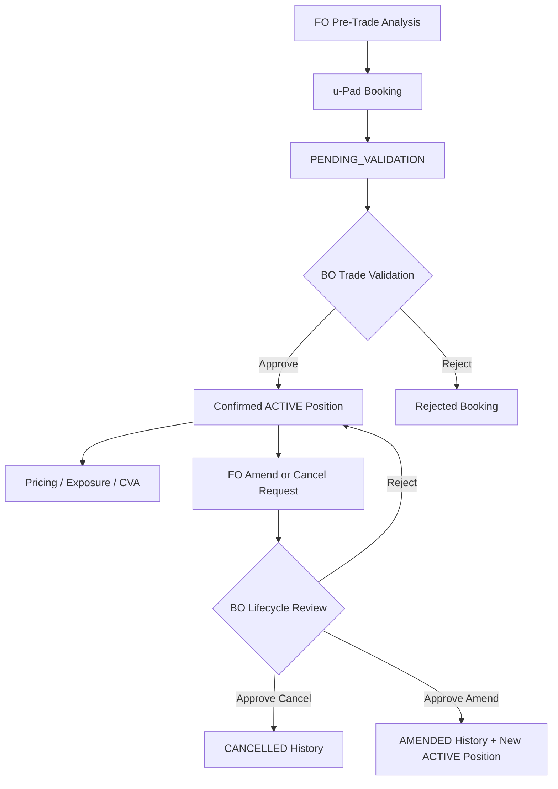

<p align="center">
  
</p>

# NexusXVA

NexusXVA is a risk workstation for learning and building Front Office, Back Office, and XVA-style workflows on portfolios of European options.

The project is not trying to be Murex or Bloomberg. The idea is to build, step by step, a clear platform where the full cycle can be seen:

```text
FO analyzes and books
  -> BO validates
  -> portfolio confirmed
  -> pricing
  -> exposure
  -> CVA
  -> operational dashboard
```

## Current Status

* Java Spring Boot backend with PostgreSQL, Flyway, JPA, and Testcontainers.
* Next.js frontend with screens based on the active group.
* Auth with multi-group users: `FO`, `BO`, `ADMIN`.
* Persisted portfolio management.
* u-Pad for sending bookings to BO.
* Amendments and cancellations with maker-checker workflow.
* Persisted user notifications.
* Trade Economics V1 with execution premium and unrealized P&L.
* Immutable EOD snapshots and Daily P&L against the previous close.
* Persisted Run History for pricing, exposure, and CVA auditability.
* Individual and portfolio-level Black-Scholes pricing.
* Monte Carlo Exposure V1.
* CVA V1.1 with flat mode and simple curves.
* Counterparties, netting sets, static collateral and netting-set CVA V1.
* Market data integration through the `marketdata` boundary, using either Blemberg or a local provider.

## Architecture



## Operational Workflow



## Groups

* **FO**: FO Desk, Pre-Trade Analysis, Stress Testing, u-Pad, Portfolios, Pricing, Exposure, CVA, and Run History.
* **BO**: Trade Validation, Lifecycle Reporting, Trading Limits, EOD Control, and Run History.
* **ADMIN**: users, groups, FO permissions, portfolio visibility, workflow map, and Run History.

A user can belong to multiple groups. After login, the user chooses the active group for the session.

## Positions and Lifecycle

Confirmed positions have a `lifecycleStatus`:

* `ACTIVE`: included in pricing, exposure, stress, and CVA.
* `CANCELLED`: historical position, excluded from analytics.
* `AMENDED`: historical position, excluded from analytics.

When BO approves an amendment, the original position is marked as `AMENDED` and a new `ACTIVE` position is created. Because of this, an `AMENDED` position is not modified again; the next change must be made on the newly created active position.

BO also has **Lifecycle Reporting**, which summarizes amendments/cancellations, pending request aging, average review time, and concentration by portfolio/symbol. FO can query its own lifecycle report through the API, while BO can see the full operational book.

## Notifications

NexusXVA stores persisted notifications per user:

* BO is notified when FO submits a booking, amendment, or cancellation.
* FO is notified when BO approves or rejects its requests.
* The header bell shows the unread count and allows users to mark notifications as read.

## Trade Economics and P&L

Option bookings can store an optional `executionPrice`: the negotiated premium per unit. This should not be confused with the strike or the spot.

```text
tradeValue = executionPrice * quantity
marketValue = theoreticalUnitPrice * quantity
unrealizedPnl = marketValue - tradeValue
```

Historical positions without an execution premium remain valid, but their P&L is shown as unavailable instead of assuming a zero cost.

## EOD and Daily P&L

EOD does not modify the original premium or the positions. It stores an audited snapshot of the close:

```text
During the day:
  unrealized P&L = current market value - original trade value

At close:
  save EOD snapshot by portfolio and position

Next day:
  daily P&L = current market value - previous EOD market value
```

A position created after the close uses its execution premium as the daily reference. If there is no EOD and no execution premium, Daily P&L remains unavailable.

From `EOD Control`, BO runs a global close across all portfolios. Each portfolio is processed independently and the batch reports `CAPTURED`, `SKIPPED`, or `FAILED`, so a problematic book does not hide the result of the others. The portfolio selector is then used to inspect each portfolio’s history.

If the close was incorrect, BO does not delete the EOD. Instead, BO uses `Void` to cancel it with a reason, or `Recapture` to mark the previous close as `SUPERSEDED` and create a new `ACTIVE` close for the same portfolio/date. Daily P&L only uses `ACTIVE` closes.

The scheduler is disabled by default. It can be enabled with:

```bash
NEXUSXVA_EOD_ENABLED=true docker compose up --build
```

By default, it runs at `17:15` from Monday to Friday in `America/New_York`. EOD rejects stale market data and portfolios with active positions that cannot be valued.

## Run History

Each portfolio pricing, Exposure, and CVA execution stores an audited copy in `valuation_runs`:

* input JSON sent to the calculation.
* response JSON returned by the backend.
* compact summary for quick inspection.
* user, active group, portfolio, model, date, and status: `SUCCESS` or `FAILED`.

This does not replace EOD and does not store market data as the official source. It is an execution history used to review what was run, with which parameters, and what the system returned.

## Counterparties, Netting and Collateral

ADMIN can configure counterparties, netting sets, assign portfolios to a netting set, and set a simple static collateral amount. FO can then run CVA in either single-portfolio mode or netting-set mode.

Netting-set CVA V1 aggregates the assigned portfolio exposure profiles, subtracts static collateral from positive exposure buckets, and applies the existing CVA formula. This is intentionally an early model: it is not path-level legal netting, CSA margining, collateral calls, or wrong-way risk.

## Users and P&L Demo Portfolios

Flyway creates three additional users:

| User       | Password  | Group | Portfolios             |
| ---------- | --------- | ----- | ---------------------- |
| `fo.tech`  | `fo12345` | FO    | Tech Options, US Banks |
| `fo.macro` | `fo12345` | FO    | US Banks, Macro Hedges |
| `bo.pnl`   | `bo12345` | BO    | Validation and control |

Created portfolios:

* `P&L Demo - Tech Options`
* `P&L Demo - US Banks`
* `P&L Demo - Macro Hedges`

Each book includes execution premiums and a test previous EOD.

## Run Everything

```bash
docker compose up --build
```

Common URLs:

* Frontend: `http://localhost:3000`
* Backend: `http://localhost:8080`
* External Blemberg, if running: `http://localhost:8081`

## Documentation

* Backend: [backend/README.md](backend/README.md)
* System logic EN: [docs/docs-EN/SystemLogic.md](docs/docs-EN/SystemLogic.md)
* System logic ES: [docs/docs-ES/LogicaDelSistema.md](docs/docs-ES/LogicaDelSistema.md)
* Data model ES: [docs/docs-ES/DataModel.md](docs/docs-ES/DataModel.md)
* Cash equities and delta hedging ES: [docs/docs-ES/CashEquitiesYDeltaHedgingPlan.md](docs/docs-ES/CashEquitiesYDeltaHedgingPlan.md)
* Financial concepts EN: [docs/docs-EN/FinancialConcepts.md](docs/docs-EN/FinancialConcepts.md)
* Financial concepts ES: [docs/docs-ES/ConceptosFinancieros.md](docs/docs-ES/ConceptosFinancieros.md)
* EOD process ES: [docs/docs-ES/ProcesoEOD.md](docs/docs-ES/ProcesoEOD.md)
* EOD process EN: [docs/docs-EN/EodProcess.md](docs/docs-EN/EodProcess.md)

## Next Steps

Natural next candidates are:

* FX and multi-currency.
* Full cash equity lifecycle/EOD for more detailed P&L.
* Admin UI polish for counterparty/netting-set setup.
* Persisted credit curve master data for richer CVA.
