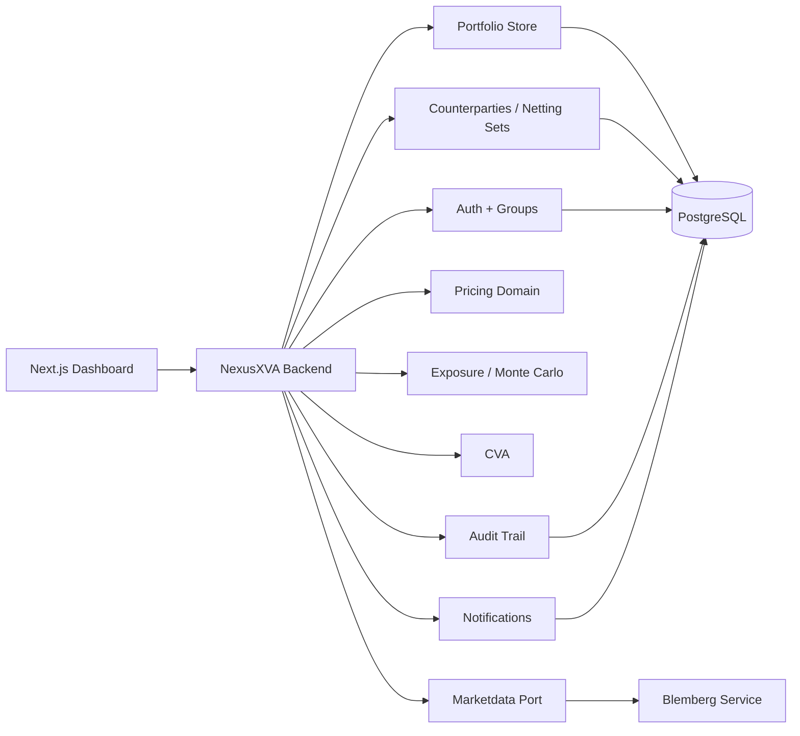
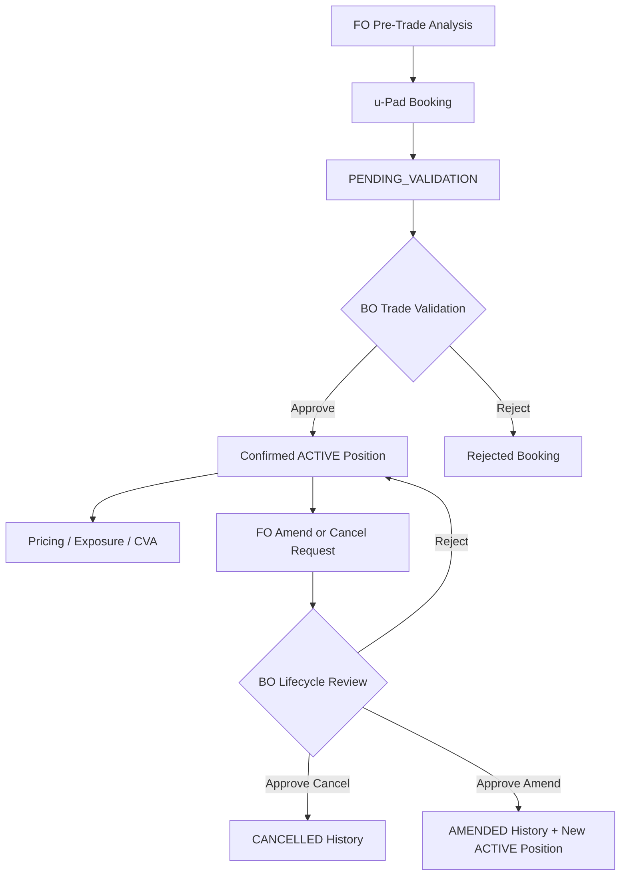

<p align="center">
  
</p>

# NexusXVA

NexusXVA is a risk workstation for learning and building Front Office, Back Office, and XVA-style workflows on portfolios of European options.

The project is not trying to be Murex or Bloomberg. The idea is to build, step by step, a clear platform where the full cycle can be seen:

```text
FO analyzes and books
  -> BO validates
  -> portfolio confirmed
  -> pricing
  -> exposure
  -> CVA
  -> operational dashboard
```

## Current Status

* Java Spring Boot backend with PostgreSQL, Flyway, JPA, and Testcontainers.
* Next.js frontend with screens based on the active group.
* Auth with multi-group users: `FO`, `BO`, `ADMIN`.
* Persisted portfolio management.
* u-Pad for sending bookings to BO.
* Amendments and cancellations with maker-checker workflow.
* FO P&L Snapshot and BO Operations Reporting derived from bookings, lifecycle and EOD.
* Persisted user notifications.
* Trade Economics V1 with execution premium and unrealized P&L.
* Immutable EOD snapshots and Daily P&L against the previous close.
* Persisted Run History for pricing, exposure, and CVA auditability.
* Audit Trail V1 for user activity, denied access, workflow actions, and ADMIN review.
* Rotated backend technical logs for system, auth, market-data integration, EOD jobs, and errors.
* Individual and portfolio-level Black-Scholes pricing.
* Monte Carlo Exposure V1.
* CVA V1.1 with flat mode and simple curves.
* ADMIN XVA Setup for counterparties, netting sets, portfolio assignments, active/inactive controls and static collateral.
* Netting-set CVA V1 using active XVA setup records.
* Market data integration through the `marketdata` boundary, using either Blemberg or a local provider.

## Architecture


```mermaid
flowchart LR
    UI[Next.js Dashboard] --> API[NexusXVA Backend]
    API --> Auth[Auth + Groups]
    API --> Audit[Audit Trail]
    API --> Portfolio[Portfolio Store]
    API --> Pricing[Pricing Domain]
    API --> Exposure[Exposure / Monte Carlo]
    API --> CVA[CVA]
    API --> XVA[Counterparties / Netting Sets]
    API --> MarketData[Marketdata Port]
    MarketData --> Blemberg[Blemberg Service]
    Portfolio --> DB[(PostgreSQL)]
    XVA --> DB
    Auth --> DB
    Audit --> DB
    API --> Notifications[Notifications]
    Notifications --> DB
```

## Operational Workflow


```mermaid
flowchart TD
    A[FO Pre-Trade Analysis] --> B[u-Pad Booking]
    B --> C[PENDING_VALIDATION]
    C --> D{BO Trade Validation}
    D -->|Approve| E[Confirmed ACTIVE Position]
    D -->|Reject| F[Rejected Booking]
    E --> G[Pricing / Exposure / CVA]
    E --> H[FO Amend or Cancel Request]
    H --> I{BO Lifecycle Review}
    I -->|Approve Cancel| J[CANCELLED History]
    I -->|Approve Amend| K[AMENDED History + New ACTIVE Position]
    I -->|Reject| E
```

## Groups

* **FO**: FO Desk, Pre-Trade Analysis, Stress Testing, u-Pad, Portfolios, Pricing, Exposure, CVA, and Run History.
* **BO**: Trade Validation, Lifecycle Reporting, Operations Reporting, Trading Limits, EOD Control, and Run History.
* **ADMIN**: users, groups, FO permissions, portfolio visibility, Operational Control, workflow map, XVA Setup, Audit Logs, and Run History.

A user can belong to multiple groups. After login, the user chooses the active group for the session.

## Operational Control

ADMIN owns the global operating calendar from **Operational Control**:

* timezone: default `America/New_York`
* business days: default Monday to Friday
* trading window: default `09:30` to `16:00`
* blocking mode: default enabled
* scheduled EOD time: default `17:15`

When authentication is enabled, ADMIN can independently block two families of actions outside the trading window: new FO trade bookings/lifecycle requests, and risk runs such as pricing, Pre-Trade Analysis, Stress, Delta Hedge, Exposure and CVA. If a block is disabled, that family remains advisory only. BO validation, BO EOD corrections, read-only reporting, login, notifications, and ADMIN configuration remain available.

The header shows `Trading Open`, `Trading Closed`, or `Window Advisory`. FO/risk screens disable their main action buttons only when blocking is enabled and the window is closed; the backend still enforces the rule with `409 Operational window is closed`.

The ADMIN checkbox controls the runtime policy. `NEXUSXVA_OPERATIONAL_CONTROL_ENFORCEMENT_ENABLED` defaults to `true` and exists only as a controlled local/test escape hatch; production-like environments should keep the env guard enabled.

## Positions and Lifecycle

Confirmed positions have a `lifecycleStatus`:

* `ACTIVE`: included in pricing, exposure, stress, and CVA.
* `CANCELLED`: historical position, excluded from analytics.
* `AMENDED`: historical position, excluded from analytics.

When BO approves an amendment, the original position is marked as `AMENDED` and a new `ACTIVE` position is created. Because of this, an `AMENDED` position is not modified again; the next change must be made on the newly created active position.

BO also has **Lifecycle Reporting**, which summarizes amendments/cancellations, pending request aging, average review time, and concentration by portfolio/symbol. **Operations Reporting** adds a daily control view for pending bookings, pending lifecycle requests, missing EOD closes and corrected EOD runs. FO can query its own lifecycle and P&L snapshot through the API, while BO can see the full operational book.

## Notifications

NexusXVA stores persisted notifications per user:

* BO is notified when FO submits a booking, amendment, or cancellation.
* FO is notified when BO approves or rejects its requests.
* The header bell shows the unread count and allows users to mark notifications as read.

## Trade Economics and P&L

Option bookings can store an optional `executionPrice`: the negotiated premium per unit. This should not be confused with the strike or the spot.

```text
tradeValue = executionPrice * quantity
marketValue = theoreticalUnitPrice * quantity
unrealizedPnl = marketValue - tradeValue
```

Historical positions without an execution premium remain valid, but their P&L is shown as unavailable instead of assuming a zero cost.

## EOD and Daily P&L

EOD does not modify the original premium or the positions. It stores an audited snapshot of the close:

```text
During the day:
  unrealized P&L = current market value - original trade value

At close:
  save EOD snapshot by portfolio and position

Next day:
  daily P&L = current market value - previous EOD market value
```

A position created after the close uses its execution premium as the daily reference. If there is no EOD and no execution premium, Daily P&L remains unavailable.

From `EOD Control`, BO runs a global close across all portfolios. Each portfolio is processed independently and the batch reports `CAPTURED`, `SKIPPED`, or `FAILED`, so a problematic book does not hide the result of the others. The portfolio selector is then used to inspect each portfolio’s history.

If the close was incorrect, BO does not delete the EOD. Instead, BO uses `Void` to cancel it with a reason, or `Recapture` to mark the previous close as `SUPERSEDED` and create a new `ACTIVE` close for the same portfolio/date. Daily P&L only uses `ACTIVE` closes.

Scheduled EOD is configured from ADMIN -> Operational Control. The scheduler wakes once per minute, reads the database setting, and runs once per business date after the configured EOD time. EOD rejects stale market data unless ADMIN explicitly enables stale market data for close.

The scheduler bean is enabled by default with `NEXUSXVA_EOD_SCHEDULER_ENABLED=true`; tests disable it to avoid background jobs against temporary databases.

## Run History

Each portfolio pricing, Exposure, single-portfolio CVA, and netting-set CVA execution stores an audited copy in `valuation_runs`:

* input JSON sent to the calculation.
* response JSON returned by the backend.
* compact summary for quick inspection.
* user, active group, scope (`PORTFOLIO` or `NETTING_SET`), model, date, and status: `SUCCESS` or `FAILED`.

This does not replace EOD and does not store market data as the official source. It is an execution history used to review what was run, with which parameters, and what the system returned.

## Audit Trail and Logs

NexusXVA separates user audit from technical logging:

* `audit_events` in PostgreSQL is the official activity trail. It records auth events, denied access, workflow approvals/rejections, portfolio changes, EOD corrections and valuation requests with user, active group, session, endpoint, resource and correlation id.
* ADMIN can inspect it from **Audit Logs** using filters by user, module, outcome, resource and date.
* Backend log files are for debugging and support. Docker writes them to `backend/logs/` through a bind mount to `/app/logs`.
* Logs include `correlationId`, user and active group when available, so an audit event can be linked back to technical errors.

Audit metadata is sanitized. Passwords, cookies, CSRF tokens, raw request bodies and full responses are not stored.

## Counterparties, Netting and Collateral

ADMIN can configure counterparties, netting sets, assign portfolios to a netting set, activate/deactivate setup records, and set a simple static collateral amount from **XVA Setup**. FO can then run CVA in either single-portfolio mode or active netting-set mode.

Netting-set CVA V1 aggregates the assigned portfolio exposure profiles, subtracts static collateral from positive exposure buckets, and applies the existing CVA formula. This is intentionally an early model: it is not path-level legal netting, CSA margining, collateral calls, or wrong-way risk.

## Users and P&L Demo Portfolios

Flyway creates three additional users:

| User       | Password  | Group | Portfolios             |
| ---------- | --------- | ----- | ---------------------- |
| `fo.tech`  | `fo12345` | FO    | Tech Options, US Banks |
| `fo.macro` | `fo12345` | FO    | US Banks, Macro Hedges |
| `bo.pnl`   | `bo12345` | BO    | Validation and control |

Created portfolios:

* `P&L Demo - Tech Options`
* `P&L Demo - US Banks`
* `P&L Demo - Macro Hedges`

Each book includes execution premiums and a test previous EOD.

## Workflow Demo Portfolios

To populate ADMIN Workflows and BO queues with realistic demo entries:

```bash
docker compose exec -T postgres psql -U nexusxva -d nexusxva < backend/src/main/resources/db/demo/demo_workflows.sql
```

This creates:

* `Workflow Demo - FO Tech Intake`
* `Workflow Demo - Macro Approval Queue`
* `Workflow Demo - Metals Lifecycle`

The seed includes pending, confirmed and rejected trade bookings plus pending, approved and rejected lifecycle requests. To see them, log in as ADMIN and open **Workflows**; use the portfolio filter to focus on one demo book. BO users can also inspect them in **Trade Validation** and **Lifecycle Reporting**.

## Heavy Demo Portfolios

To create larger books that put more pressure on pricing, stress testing, exposure, CVA and table rendering:

```bash
docker compose exec -T postgres psql -U nexusxva -d nexusxva < backend/src/main/resources/db/demo/demo_heavy_portfolios.sql
```

This creates three synthetic heavy books:

* `Heavy Demo - Mega Tech Vol Warehouse`
* `Heavy Demo - Cross Asset Scenario Grid`
* `Heavy Demo - Metals Macro Hedge Stack`

Together they include roughly 512 European option positions, 32 cash equity positions, plus 99 workflow-visible booking requests and 81 lifecycle requests in pending, accepted/confirmed and rejected states.

## Run Everything

```bash
docker compose up --build
```

Common URLs:

* Frontend: `http://localhost:3000`
* Backend: `http://localhost:8080`
* External Blemberg, if running: `http://localhost:8081`

## Documentation

* Backend: [backend/README.md](backend/README.md)
* System logic EN: [docs/docs-EN/SystemLogic.md](docs/docs-EN/SystemLogic.md)
* System logic ES: [docs/docs-ES/LogicaDelSistema.md](docs/docs-ES/LogicaDelSistema.md)
* Data model ES: [docs/docs-ES/DataModel.md](docs/docs-ES/DataModel.md)
* Cash equities and delta hedging ES: [docs/docs-ES/CashEquitiesYDeltaHedgingPlan.md](docs/docs-ES/CashEquitiesYDeltaHedgingPlan.md)
* Financial concepts EN: [docs/docs-EN/FinancialConcepts.md](docs/docs-EN/FinancialConcepts.md)
* Financial concepts ES: [docs/docs-ES/ConceptosFinancieros.md](docs/docs-ES/ConceptosFinancieros.md)
* EOD process ES: [docs/docs-ES/ProcesoEOD.md](docs/docs-ES/ProcesoEOD.md)
* EOD process EN: [docs/docs-EN/EodProcess.md](docs/docs-EN/EodProcess.md)

## Next Steps

Natural next candidates are:

* Persisted credit curve master data for richer CVA.
* Persisted valuation/EOD reporting history if FO/BO need saved report views.
* Cash equity lots/executions for average cost and realized P&L.
