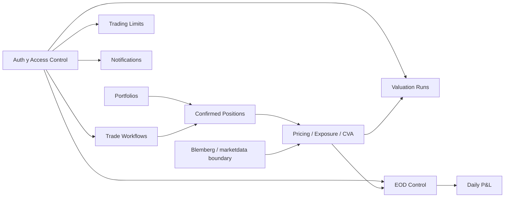
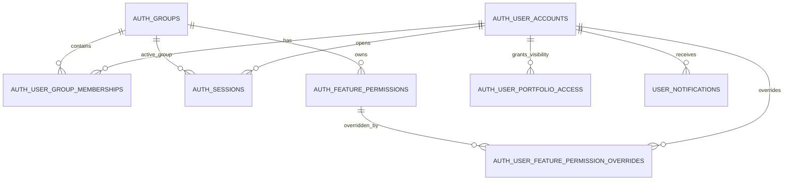
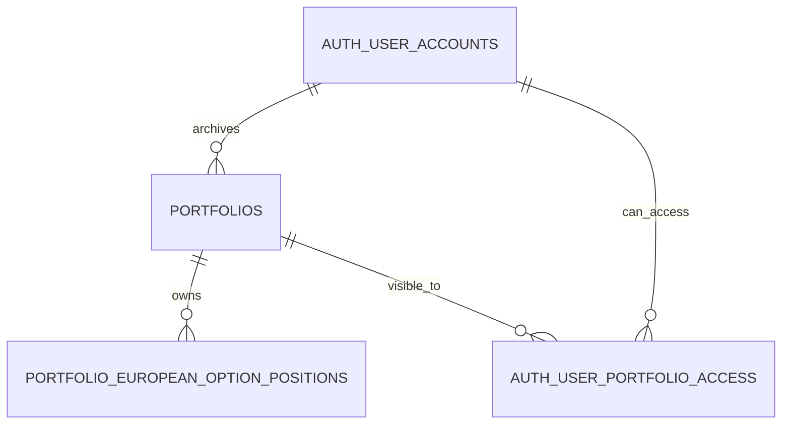
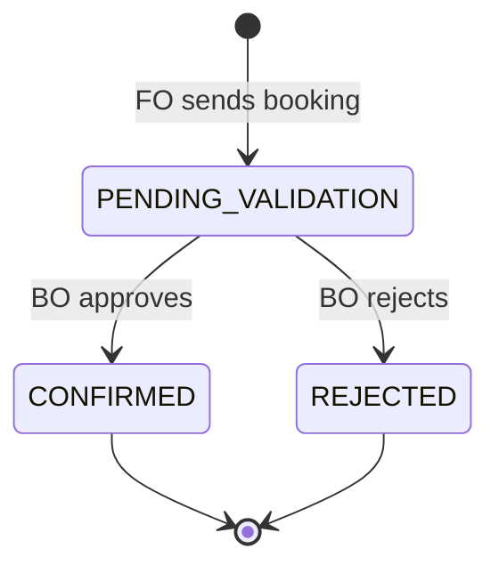
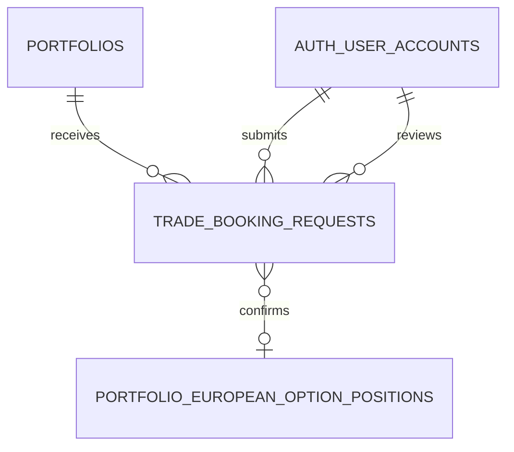
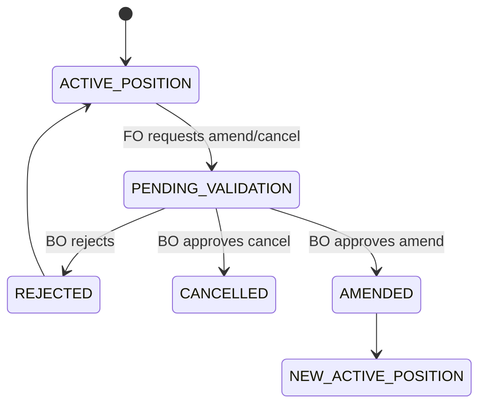
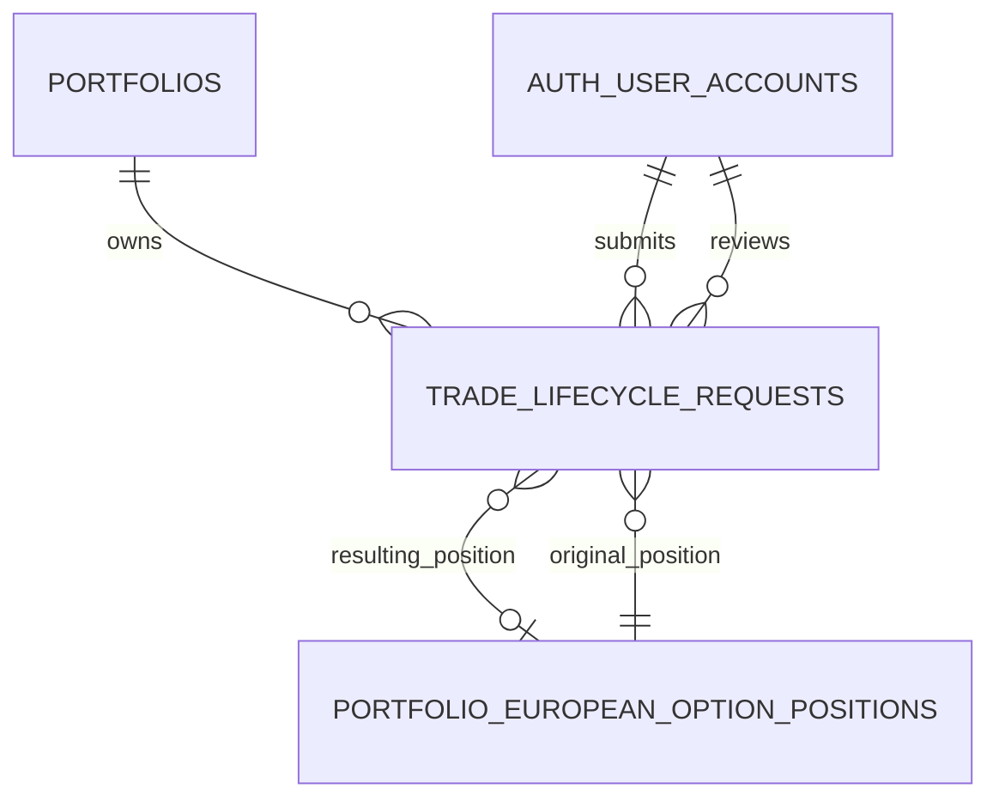
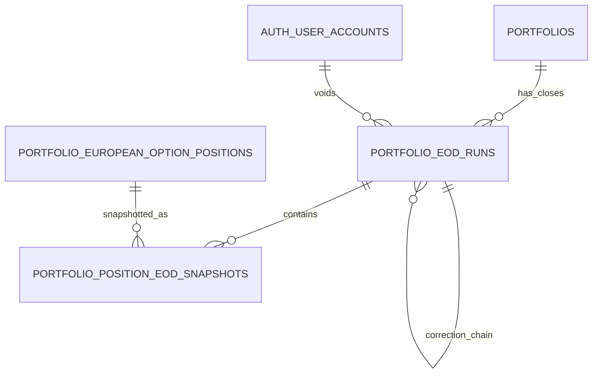
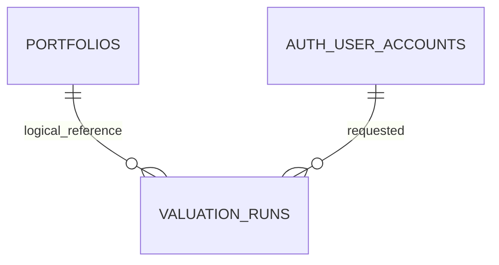
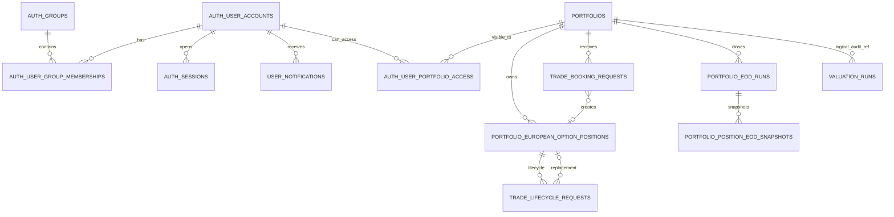

# Data Model NexusXVA

Este documento resume el modelo de datos actual de NexusXVA. La idea es que cualquier dev pueda entender que guarda cada tabla, como se conectan los dominios y que datos NO deben mezclarse.

## Principios del Modelo

1. **Portfolio es trade store**: guarda portfolios y posiciones confirmadas. No guarda `spot`, `volatility`, `riskFreeRate`, `dividendYield` ni snapshots de Blemberg.
2. **Market data vive fuera**: NexusXVA consume Blemberg/local provider por la frontera `marketdata`, pero no persiste market data como master data.
3. **FO no crea posiciones directas**: FO crea solicitudes. BO valida. Solo una aprobacion BO crea o modifica posiciones confirmadas.
4. **Historico no se borra**: portfolios se archivan; EOD se corrige con `VOIDED`/`SUPERSEDED`; valuation runs quedan como auditoria.
5. **Auth y permisos son relacionales**: usuarios, grupos, sesiones, permisos FO y visibilidad de portfolios son tablas separadas.

## Vista General



## Dominios y Tablas

### 1. Auth, Grupos y Acceso

| Tabla | Proposito | Notas clave |
|---|---|---|
| `auth_user_accounts` | Usuarios de la app. | Guarda username, display name, BCrypt hash, estado activo, `portfolio_access_mode`. |
| `auth_groups` | Grupos funcionales. | `FO`, `BO`, `ADMIN`. |
| `auth_user_group_memberships` | Relacion many-to-many usuario/grupo. | Un usuario puede tener varios grupos. |
| `auth_sessions` | Sesiones backend. | Guarda hash del token, CSRF, expiracion y `active_group_code`. |
| `auth_feature_permissions` | Catalogo de permisos funcionales. | Hoy son principalmente permisos FO. |
| `auth_user_feature_permission_overrides` | Overrides por usuario. | Permite activar/desactivar permisos especificos. |
| `auth_user_portfolio_access` | Visibilidad selectiva de portfolios. | Usado cuando `portfolio_access_mode = SELECTED`. |
| `user_notifications` | Inbox persistido por usuario. | Notificaciones de approval/rejection/workflow. |



## 2. Portfolio y Posiciones Confirmadas

| Tabla | Proposito | Notas clave |
|---|---|---|
| `portfolios` | Libro o portfolio de negocio. | `name`, `description`, `base_currency`, timestamps y archivo logico. |
| `portfolio_european_option_positions` | Posiciones confirmadas de opciones europeas. | Solo terminos del trade: symbol, type, strike, maturity, quantity, execution premium opcional. |

### `portfolios`

Campos importantes:

- `id`: UUID publico.
- `name`: nombre del book.
- `description`: descripcion opcional.
- `base_currency`: hoy normalmente `USD`.
- `created_at`, `updated_at`.
- `archived_at`, `archived_by_user_id`, `archive_reason`: archivo logico, no hard delete operativo.

### `portfolio_european_option_positions`

Campos importantes:

- `portfolio_id`: portfolio owner.
- `underlying_symbol`: simbolo como `AAPL`, `MSFT`, `QQQ`.
- `option_type`: `CALL` o `PUT`.
- `strike`, `maturity_date`, `quantity`.
- `execution_price`: premium negociado por unidad, opcional.
- `lifecycle_status`: `ACTIVE`, `CANCELLED`, `AMENDED`.
- `strategy_id`, `strategy_type`, `strategy_name`, `strategy_leg_index`: agrupan legs de estrategias.

Regla importante:

```text
Pricing / Exposure / CVA usan solo positions con lifecycle_status = ACTIVE.
```



## 3. Trade Booking Workflow

FO no inserta directamente en `portfolio_european_option_positions`. Primero crea una solicitud en `trade_booking_requests`.

| Tabla | Proposito | Notas clave |
|---|---|---|
| `trade_booking_requests` | Solicitudes FO para crear trades. | Estados `PENDING_VALIDATION`, `CONFIRMED`, `REJECTED`. |
| `portfolio_european_option_positions` | Resultado confirmado. | Se crea solo si BO aprueba. |

### `trade_booking_requests`

Guarda:

- Snapshot del portfolio: `portfolio_id`, `portfolio_name`.
- Terminos del trade: symbol, type, strike, maturity, quantity, execution price.
- Maker/checker: submitted by, reviewed by, timestamps.
- Estado y motivo de rechazo.
- `confirmed_position_id` para single option.
- `confirmed_position_ids_json` para estrategias multi-leg.
- `booking_type`: `SINGLE_OPTION` u `OPTION_STRATEGY`.
- `strategy_legs_json`: legs enviados si es estrategia.
- `booking_notional`: notional preventivo usado por limits.





## 4. Lifecycle Workflow: Amend y Cancel

Las posiciones confirmadas no se editan ni se borran directamente. FO crea una solicitud de lifecycle y BO decide.

| Tabla | Proposito | Notas clave |
|---|---|---|
| `trade_lifecycle_requests` | Solicitudes FO para amend/cancel. | Estados `PENDING_VALIDATION`, `APPROVED`, `REJECTED`. |
| `portfolio_european_option_positions` | Posicion original y, si aplica, nueva posicion. | Cancel marca original como `CANCELLED`; amend marca original `AMENDED` y crea nueva `ACTIVE`. |

### `trade_lifecycle_requests`

Guarda:

- Snapshot de la posicion original.
- Terminos solicitados si es `AMEND`.
- Maker/checker y timestamps.
- `resulting_position_id` cuando un amend crea una nueva posicion activa.
- Un indice unico evita dos requests pendientes para la misma posicion.





## 5. Trading Limits

| Tabla | Proposito | Notas clave |
|---|---|---|
| `trading_limit_policies` | Limites preventivos por usuario FO. | No guarda consumo; el consumo se calcula desde `trade_booking_requests`. |

Campos clave:

- `user_id`: PK y FK a usuario.
- `max_trades_per_hour`, `max_trades_per_day`.
- `max_notional_per_hour`, `max_notional_per_day`.
- `notional_currency`: hoy solo `USD`.
- `active`, timestamps, updater, version.

Regla:

```text
usage = bookings enviados por el usuario en la hora/dia UTC actual
notional V1 = abs(quantity) * strike
```

Rejected bookings siguen consumiendo el periodo si fueron enviados. Breaches bloqueados antes de crear booking no consumen nada.

## 6. EOD, Accounting Snapshot y Daily P&L

EOD es el cierre auditado por portfolio/date. No modifica trades ni posiciones.

| Tabla | Proposito | Notas clave |
|---|---|---|
| `portfolio_eod_runs` | Cierre por portfolio y business date. | Estados `ACTIVE`, `VOIDED`, `SUPERSEDED`. |
| `portfolio_position_eod_snapshots` | Snapshot por posicion dentro del run. | Guarda valores de mercado, trade value y P&L al cierre. |

### `portfolio_eod_runs`

Campos importantes:

- `portfolio_id`, `business_date`, `base_currency`.
- `total_market_value`, `total_trade_value`, `total_unrealized_pnl`.
- `positions_without_execution_price`.
- `captured_at`, `source`.
- `status`: `ACTIVE`, `VOIDED`, `SUPERSEDED`.
- `voided_at`, `voided_by_user_id`, `void_reason`.
- `correction_of_run_id`: liga recaptures al run corregido.

Reglas:

- Solo puede existir un EOD `ACTIVE` por `portfolio_id + business_date`.
- `VOIDED` y `SUPERSEDED` preservan auditoria.
- Daily P&L usa solo EOD `ACTIVE`.

### `portfolio_position_eod_snapshots`

Guarda:

- `run_id`, `position_id`.
- Snapshot de symbol y quantity.
- `unit_price`, `market_value`.
- `execution_price`, `trade_value`, `unrealized_pnl`.
- `market_data_as_of`, `market_data_source`, `stale`.



## 7. Valuation Run History

Run History guarda auditoria de ejecuciones de Pricing, Exposure y CVA. No es EOD, no es P&L oficial y no es market data.

| Tabla | Proposito | Notas clave |
|---|---|---|
| `valuation_runs` | Historial auditado de calculos. | Guarda input/result/summary JSON y metadata del usuario. |

Campos importantes:

- `portfolio_id`: UUID del portfolio. No tiene FK fuerte para preservar historial aunque tests o procesos borren fisicamente.
- `portfolio_name_snapshot`: nombre al momento del run.
- `run_type`: `PRICING`, `EXPOSURE`, `CVA`.
- `model`: modelo usado.
- `valuation_date`.
- `status`: `SUCCESS`, `FAILED`.
- `requested_by_user_id`, username/display name snapshots, `active_group_code`.
- `input_json`, `result_json`, `summary_json`.
- `error_message`.
- `created_at`.

Regla:

```text
Run History se consulta para auditoria.
Pricing / Exposure / CVA recalculan desde portfolio + marketdata, no desde valuation_runs.
```



La relacion con `PORTFOLIOS` es logica, no FK fuerte en DB. Esto permite conservar el snapshot aunque el portfolio haya sido archivado o, en entornos de test, borrado fisicamente.

## 8. Notificaciones

| Tabla | Proposito | Notas clave |
|---|---|---|
| `user_notifications` | Inbox persistido del usuario. | Se borra si se borra el usuario. `read_at` marca lectura. |

Eventos tipicos:

- FO envia booking: BO recibe notificacion.
- BO aprueba/rechaza: FO recibe notificacion.
- FO envia amend/cancel: BO recibe notificacion.
- BO revisa lifecycle: FO recibe notificacion.

## Mapa de Relaciones Principal



## Decisiones Que Evitan Mezcla de Responsabilidades

| Decision | Por que importa |
|---|---|
| Posiciones no guardan market data. | Evita mezclar terminos del trade con estado cambiante del mercado. |
| Bookings y lifecycle requests estan separados de positions. | Permite maker-checker y auditoria BO. |
| EOD tiene sus propias tablas. | Daily P&L necesita cierres oficiales, no runs ad hoc. |
| Valuation runs no reemplazan EOD. | Un run intraday no debe convertirse accidentalmente en accounting close. |
| Trading limits derivan consumo desde bookings. | Evita contadores duplicados que puedan desincronizarse. |
| Portfolio archive reemplaza hard delete operativo. | Conserva historico de workflow, EOD y auditoria. |

## Lectura Rapida Por Caso de Uso

### Crear y aprobar un trade nuevo

```text
auth_user_accounts
  -> trade_booking_requests PENDING_VALIDATION
  -> BO approve
  -> portfolio_european_option_positions ACTIVE
```

### Amend de una posicion

```text
portfolio_european_option_positions ACTIVE
  -> trade_lifecycle_requests PENDING_VALIDATION
  -> BO approve
  -> original position AMENDED
  -> new position ACTIVE
```

### EOD close

```text
portfolios ACTIVE
  -> active positions
  -> pricing inputs from marketdata
  -> portfolio_eod_runs ACTIVE
  -> portfolio_position_eod_snapshots
```

### Pricing / Exposure / CVA run

```text
portfolio + active positions
  -> marketdata pricing inputs
  -> analytics response
  -> valuation_runs audit copy
```

## Tabla de Tablas

| Dominio | Tablas |
|---|---|
| Auth | `auth_user_accounts`, `auth_groups`, `auth_user_group_memberships`, `auth_sessions` |
| Access control | `auth_feature_permissions`, `auth_user_feature_permission_overrides`, `auth_user_portfolio_access` |
| Portfolio | `portfolios`, `portfolio_european_option_positions` |
| FO/BO booking | `trade_booking_requests` |
| Lifecycle | `trade_lifecycle_requests` |
| Limits | `trading_limit_policies` |
| Notifications | `user_notifications` |
| EOD/P&L | `portfolio_eod_runs`, `portfolio_position_eod_snapshots` |
| Valuation audit | `valuation_runs` |
